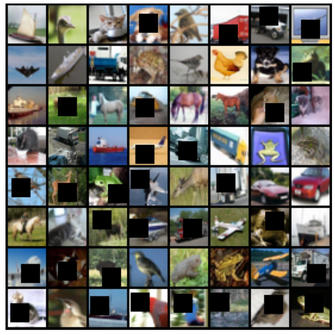
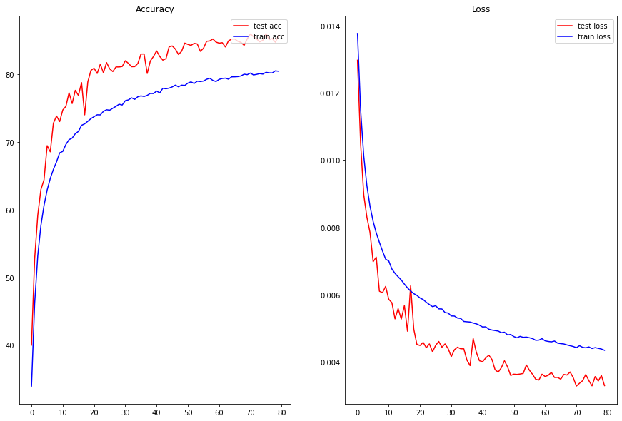
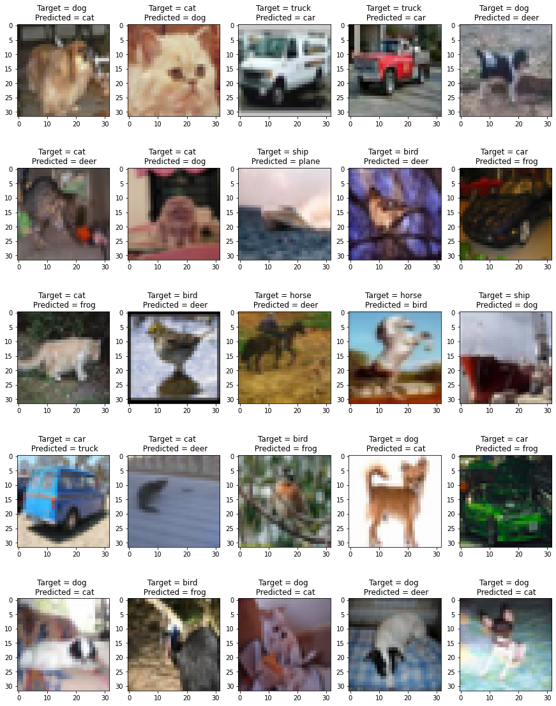

Group Members: Nishad, Senthil, Prasad

# CIFAR10 Classification
The goal here is to achieve 85% accuracy on the cifar 10 dataset using
- Depthwise Separable Convolution
- Dilated Convolution
- Not using Max Pooling
- Augmentation
  - Horizontal Flip
  - ShiftScaleRotate
  - CoarseDropout

## Mean and Standard Deviation of the dataset
```python
# load the training data
train_data = datasets.CIFAR10('./cifar10_data', train=True, download=True)

# use np.concatenate to stick all the images together to form a 1600000 X 32 X 3 array
x = np.concatenate([np.asarray(train_data[i][0]) for i in range(len(train_data))])

# calculate the mean and std along the (0, 1) axes and divide by maximum pixel value of 255
mean = np.mean(x, axis=(0, 1))/255
std = np.std(x, axis=(0, 1))/255
```
```
Shape of training data =  (1600000, 32, 3)
Mean =  [0.49139968 0.48215841 0.44653091]
Std Deviation =  [0.24703223 0.24348513 0.26158784]
```

## Training Dataset Images


## Network Used
Below is the network we have used as a baseline.

```
  ----------------------------------------------------------------
        Layer (type)               Output Shape         Param #
================================================================
            Conv2d-1           [-1, 16, 32, 32]             432
            Conv2d-2           [-1, 32, 32, 32]           4,608
       BatchNorm2d-3           [-1, 32, 32, 32]              64
              ReLU-4           [-1, 32, 32, 32]               0
           Dropout-5           [-1, 32, 32, 32]               0
            Conv2d-6           [-1, 32, 32, 32]              96
            Conv2d-7           [-1, 64, 15, 15]          18,432
            Conv2d-8          [-1, 128, 15, 15]          73,728
       BatchNorm2d-9          [-1, 128, 15, 15]             256
             ReLU-10          [-1, 128, 15, 15]               0
          Dropout-11          [-1, 128, 15, 15]               0
           Conv2d-12           [-1, 64, 11, 11]          73,728
           Conv2d-13             [-1, 32, 9, 9]          18,432
      BatchNorm2d-14             [-1, 32, 9, 9]              64
             ReLU-15             [-1, 32, 9, 9]               0
          Dropout-16             [-1, 32, 9, 9]               0
           Conv2d-17             [-1, 32, 9, 9]             320
           Conv2d-18             [-1, 16, 9, 9]             528
      BatchNorm2d-19             [-1, 16, 9, 9]              32
             ReLU-20             [-1, 16, 9, 9]               0
          Dropout-21             [-1, 16, 9, 9]               0
        AvgPool2d-22             [-1, 16, 1, 1]               0
           Conv2d-23             [-1, 10, 1, 1]             160
================================================================
Total params: 190,880
Trainable params: 190,880
Non-trainable params: 0
----------------------------------------------------------------
```

## Using albumentations
Built a custom transform class and function to be used with data load during transformation

```python
  class Cifar10SearchDataset(torchvision.datasets.CIFAR10):
    def __init__(self, root="~/data/cifar10", train=True, download=True, transform=None):
        super().__init__(root=root, train=train, download=download, transform=transform)

    def __getitem__(self, index):
        image, label = self.data[index], self.targets[index]

        if self.transform is not None:
            transformed = self.transform(image=image)
            image = transformed["image"]

        return image, label
```

```python
train_transform = A.Compose(
    [
        A.ShiftScaleRotate(shift_limit=0.05, scale_limit=0.05, rotate_limit=5, p=0.5),
        A.HorizontalFlip(p=0.5),
        A.CoarseDropout(max_holes = 1, max_height=16, max_width=16, min_holes = 1,
                        min_height=16, min_width=16,
                        fill_value=mean, mask_fill_value = None),
        A.Normalize(mean, std),
        ToTensorV2(),
    ]
)

test_transform = A.Compose(
    [
        A.Normalize(mean, std),
        ToTensorV2(),
    ]
)
```

## Dilated Convolutions
```python
  # Dilated convolutions
              nn.Conv2d(in_channels=128, out_channels=64, kernel_size=(3, 3), padding=0, bias=False,dilation=2),
              nn.Conv2d(in_channels=64, out_channels=32, kernel_size=(3, 3), padding=0, bias=False),
```
## Depthwise Seperable convolution
```python
  # Depthwise Seperable convolution
              nn.Conv2d(32, 32, kernel_size=3, padding=1, groups=32),
              nn.Conv2d(32, 16, kernel_size=1),
```

## Complete Model
```python
  class Net(nn.Module):
      def __init__(self):
          super(Net, self).__init__()

          # Input Block
          self.convblock1 = nn.Sequential(
              nn.Conv2d(in_channels=3, out_channels=16, kernel_size=(3, 3), bias=False,padding = 1),
              nn.Conv2d(in_channels=16, out_channels=32, kernel_size=(3, 3), bias=False, padding = 1),
              nn.BatchNorm2d(32),
              nn.ReLU(),
              nn.Dropout(0.2)
          ) # output_size = 32

          #skip connections
          self.skip1 = nn.Sequential(
              nn.Conv2d(in_channels=3, out_channels=32, kernel_size=(1, 1), bias=False),
          ) 

          # CONVOLUTION BLOCK 1
          self.convblock2 = nn.Sequential(
              nn.Conv2d(in_channels=32, out_channels=64, kernel_size=(3, 3), bias=False,stride=2),
              nn.Conv2d(in_channels=64, out_channels=128, kernel_size=(3, 3), bias=False,padding = 1),
              nn.BatchNorm2d(128),
              nn.ReLU(),
              nn.Dropout(0.1)
          ) # output_size = 30

           #skip connections
          self.skip2 = nn.Sequential(
              nn.Conv2d(in_channels=3, out_channels=64, kernel_size=(3, 3)),
          ) 

          # TRANSITION BLOCK 1
          self.convblock3 = nn.Sequential(
              # Dilated convolutions
              nn.Conv2d(in_channels=128, out_channels=64, kernel_size=(3, 3), padding=0, bias=False,dilation=2),
              nn.Conv2d(in_channels=64, out_channels=32, kernel_size=(3, 3), padding=0, bias=False),
              nn.BatchNorm2d(32),
              nn.ReLU(),      
              nn.Dropout(0.1)
          ) # output_size = 12

          # CONVOLUTION BLOCK 2
          self.convblock4 = nn.Sequential(
              # Depthwise Seperable convolution
              nn.Conv2d(32, 32, kernel_size=3, padding=1, groups=32),
              nn.Conv2d(32, 16, kernel_size=1),
              nn.BatchNorm2d(16),
              nn.ReLU(), 
              nn.Dropout(0.1)
          ) # output_size = 9

          # OUTPUT BLOCK
          self.gap = nn.Sequential(
              nn.AvgPool2d(kernel_size=9)
          ) # output_size = 1

          self.convblock5 = nn.Sequential(
              nn.Conv2d(in_channels=16, out_channels=10, kernel_size=(1, 1), padding=0, bias=False),
          ) 

      def forward(self, x):
          xin = x
          x = self.convblock1(x) + self.skip1(xin)
          x = self.convblock2(x) 
          x = self.convblock3(x)
          x = self.convblock4(x) 
          x = self.gap(x)        
          x = self.convblock5(x)

          x = x.view(-1, 10)
          return x
```

## Results:


## Misclassified Images 


## Analysis:
- Adding 2 3x3 convolutions within the conv block helped with accuracy. Tried with using just 1 3x3 convolution within a block test accuracy did not go further than 76%
- Also tried using a skip connection over the first convolution block
- Augmentation used helped with reducing the gap between train and test accuracy
- Total params: 190,880
- There is still scope to improve the accuracy of the model. The train accuracy has not reached 90%
- Max Train accuracy : 80.44%
- Max Test accuracy  : 86.03% (47th epoch)
- No of epochs : 80

## Training Logs
```
EPOCH: 1
Loss=1.7482401132583618 Batch_id=390 Accuracy=33.91: 100%|██████████| 391/391 [00:10<00:00, 38.90it/s]
Test set: Average loss: 0.0130, Accuracy: 3997/10000 (39.97%)

EPOCH: 2
Loss=1.4917255640029907 Batch_id=390 Accuracy=46.08: 100%|██████████| 391/391 [00:09<00:00, 39.72it/s]
Test set: Average loss: 0.0105, Accuracy: 5270/10000 (52.70%)

EPOCH: 3
Loss=1.1544477939605713 Batch_id=390 Accuracy=53.19: 100%|██████████| 391/391 [00:09<00:00, 39.60it/s]
Test set: Average loss: 0.0090, Accuracy: 5916/10000 (59.16%)

EPOCH: 4
Loss=1.2297558784484863 Batch_id=390 Accuracy=57.62: 100%|██████████| 391/391 [00:09<00:00, 39.71it/s]
Test set: Average loss: 0.0083, Accuracy: 6296/10000 (62.96%)

EPOCH: 5
Loss=1.044346570968628 Batch_id=390 Accuracy=60.61: 100%|██████████| 391/391 [00:09<00:00, 39.26it/s]
Test set: Average loss: 0.0078, Accuracy: 6440/10000 (64.40%)

EPOCH: 6
Loss=0.9728879928588867 Batch_id=390 Accuracy=62.89: 100%|██████████| 391/391 [00:09<00:00, 39.18it/s]
Test set: Average loss: 0.0070, Accuracy: 6945/10000 (69.45%)

EPOCH: 7
Loss=1.048119306564331 Batch_id=390 Accuracy=64.59: 100%|██████████| 391/391 [00:10<00:00, 38.91it/s]
Test set: Average loss: 0.0071, Accuracy: 6854/10000 (68.54%)

EPOCH: 8
Loss=1.0335100889205933 Batch_id=390 Accuracy=65.95: 100%|██████████| 391/391 [00:10<00:00, 38.85it/s]
Test set: Average loss: 0.0061, Accuracy: 7277/10000 (72.77%)

EPOCH: 9
Loss=1.3316773176193237 Batch_id=390 Accuracy=67.05: 100%|██████████| 391/391 [00:10<00:00, 38.87it/s]
Test set: Average loss: 0.0061, Accuracy: 7383/10000 (73.83%)

EPOCH: 10
Loss=1.0203403234481812 Batch_id=390 Accuracy=68.38: 100%|██████████| 391/391 [00:10<00:00, 39.03it/s]
Test set: Average loss: 0.0062, Accuracy: 7301/10000 (73.01%)

EPOCH: 11
Loss=0.9130550622940063 Batch_id=390 Accuracy=68.60: 100%|██████████| 391/391 [00:10<00:00, 38.59it/s]
Test set: Average loss: 0.0059, Accuracy: 7472/10000 (74.72%)

EPOCH: 12
Loss=0.7917748093605042 Batch_id=390 Accuracy=69.63: 100%|██████████| 391/391 [00:10<00:00, 38.84it/s]
Test set: Average loss: 0.0058, Accuracy: 7526/10000 (75.26%)

EPOCH: 13
Loss=0.6335767507553101 Batch_id=390 Accuracy=70.33: 100%|██████████| 391/391 [00:10<00:00, 38.71it/s]
Test set: Average loss: 0.0053, Accuracy: 7726/10000 (77.26%)

EPOCH: 14
Loss=0.9298035502433777 Batch_id=390 Accuracy=70.57: 100%|██████████| 391/391 [00:10<00:00, 38.64it/s]
Test set: Average loss: 0.0056, Accuracy: 7567/10000 (75.67%)

EPOCH: 15
Loss=1.1474138498306274 Batch_id=390 Accuracy=71.22: 100%|██████████| 391/391 [00:10<00:00, 38.68it/s]
Test set: Average loss: 0.0053, Accuracy: 7763/10000 (77.63%)

EPOCH: 16
Loss=0.8814474940299988 Batch_id=390 Accuracy=71.55: 100%|██████████| 391/391 [00:10<00:00, 38.00it/s]
Test set: Average loss: 0.0057, Accuracy: 7687/10000 (76.87%)

EPOCH: 17
Loss=0.7699893712997437 Batch_id=390 Accuracy=72.45: 100%|██████████| 391/391 [00:10<00:00, 38.38it/s]
Test set: Average loss: 0.0049, Accuracy: 7877/10000 (78.77%)

EPOCH: 18
Loss=0.8364739418029785 Batch_id=390 Accuracy=72.67: 100%|██████████| 391/391 [00:10<00:00, 38.11it/s]
Test set: Average loss: 0.0063, Accuracy: 7400/10000 (74.00%)

EPOCH: 19
Loss=0.7007755041122437 Batch_id=390 Accuracy=73.05: 100%|██████████| 391/391 [00:10<00:00, 38.51it/s]
Test set: Average loss: 0.0050, Accuracy: 7887/10000 (78.87%)

EPOCH: 20
Loss=0.9440913200378418 Batch_id=390 Accuracy=73.44: 100%|██████████| 391/391 [00:10<00:00, 38.38it/s]
Test set: Average loss: 0.0045, Accuracy: 8057/10000 (80.57%)

EPOCH: 21
Loss=0.8777683973312378 Batch_id=390 Accuracy=73.73: 100%|██████████| 391/391 [00:10<00:00, 38.73it/s]
Test set: Average loss: 0.0045, Accuracy: 8090/10000 (80.90%)

EPOCH: 22
Loss=1.0459644794464111 Batch_id=390 Accuracy=74.01: 100%|██████████| 391/391 [00:10<00:00, 38.66it/s]
Test set: Average loss: 0.0046, Accuracy: 8012/10000 (80.12%)

EPOCH: 23
Loss=0.7133547067642212 Batch_id=390 Accuracy=74.00: 100%|██████████| 391/391 [00:10<00:00, 37.94it/s]
Test set: Average loss: 0.0044, Accuracy: 8149/10000 (81.49%)

EPOCH: 24
Loss=0.7982965707778931 Batch_id=390 Accuracy=74.52: 100%|██████████| 391/391 [00:10<00:00, 38.61it/s]
Test set: Average loss: 0.0045, Accuracy: 8022/10000 (80.22%)

EPOCH: 25
Loss=0.7873681783676147 Batch_id=390 Accuracy=74.75: 100%|██████████| 391/391 [00:10<00:00, 38.18it/s]
Test set: Average loss: 0.0043, Accuracy: 8173/10000 (81.73%)

EPOCH: 26
Loss=0.829460620880127 Batch_id=390 Accuracy=74.69: 100%|██████████| 391/391 [00:10<00:00, 38.59it/s]
Test set: Average loss: 0.0045, Accuracy: 8080/10000 (80.80%)

EPOCH: 27
Loss=0.7393540740013123 Batch_id=390 Accuracy=74.98: 100%|██████████| 391/391 [00:10<00:00, 37.72it/s]
Test set: Average loss: 0.0046, Accuracy: 8040/10000 (80.40%)

EPOCH: 28
Loss=0.7061135768890381 Batch_id=390 Accuracy=75.25: 100%|██████████| 391/391 [00:10<00:00, 37.94it/s]
Test set: Average loss: 0.0044, Accuracy: 8108/10000 (81.08%)

EPOCH: 29
Loss=0.6550920009613037 Batch_id=390 Accuracy=75.57: 100%|██████████| 391/391 [00:10<00:00, 37.69it/s]
Test set: Average loss: 0.0045, Accuracy: 8108/10000 (81.08%)

EPOCH: 30
Loss=0.762669026851654 Batch_id=390 Accuracy=75.46: 100%|██████████| 391/391 [00:10<00:00, 37.84it/s]
Test set: Average loss: 0.0044, Accuracy: 8115/10000 (81.15%)

EPOCH: 31
Loss=0.753476619720459 Batch_id=390 Accuracy=76.09: 100%|██████████| 391/391 [00:10<00:00, 38.11it/s]
Test set: Average loss: 0.0042, Accuracy: 8200/10000 (82.00%)

EPOCH: 32
Loss=0.5155466794967651 Batch_id=390 Accuracy=76.21: 100%|██████████| 391/391 [00:10<00:00, 38.41it/s]
Test set: Average loss: 0.0044, Accuracy: 8161/10000 (81.61%)

EPOCH: 33
Loss=0.5233871340751648 Batch_id=390 Accuracy=76.52: 100%|██████████| 391/391 [00:10<00:00, 38.28it/s]
Test set: Average loss: 0.0044, Accuracy: 8112/10000 (81.12%)

EPOCH: 34
Loss=0.5641014575958252 Batch_id=390 Accuracy=76.29: 100%|██████████| 391/391 [00:10<00:00, 38.39it/s]
Test set: Average loss: 0.0044, Accuracy: 8113/10000 (81.13%)

EPOCH: 35
Loss=0.8016072511672974 Batch_id=390 Accuracy=76.68: 100%|██████████| 391/391 [00:10<00:00, 38.04it/s]
Test set: Average loss: 0.0044, Accuracy: 8159/10000 (81.59%)

EPOCH: 36
Loss=0.6144477725028992 Batch_id=390 Accuracy=76.81: 100%|██████████| 391/391 [00:10<00:00, 38.34it/s]
Test set: Average loss: 0.0041, Accuracy: 8299/10000 (82.99%)

EPOCH: 37
Loss=0.7860910296440125 Batch_id=390 Accuracy=76.71: 100%|██████████| 391/391 [00:10<00:00, 38.51it/s]
Test set: Average loss: 0.0039, Accuracy: 8300/10000 (83.00%)

EPOCH: 38
Loss=0.5385136604309082 Batch_id=390 Accuracy=76.88: 100%|██████████| 391/391 [00:10<00:00, 37.79it/s]
Test set: Average loss: 0.0047, Accuracy: 8012/10000 (80.12%)

EPOCH: 39
Loss=0.6154332756996155 Batch_id=390 Accuracy=77.18: 100%|██████████| 391/391 [00:10<00:00, 38.17it/s]
Test set: Average loss: 0.0043, Accuracy: 8197/10000 (81.97%)

EPOCH: 40
Loss=0.7828348875045776 Batch_id=390 Accuracy=77.15: 100%|██████████| 391/391 [00:10<00:00, 38.41it/s]
Test set: Average loss: 0.0040, Accuracy: 8263/10000 (82.63%)

EPOCH: 41
Loss=0.6386668086051941 Batch_id=390 Accuracy=77.52: 100%|██████████| 391/391 [00:10<00:00, 38.35it/s]
Test set: Average loss: 0.0040, Accuracy: 8346/10000 (83.46%)

EPOCH: 42
Loss=0.8704980611801147 Batch_id=390 Accuracy=77.24: 100%|██████████| 391/391 [00:10<00:00, 38.44it/s]
Test set: Average loss: 0.0041, Accuracy: 8264/10000 (82.64%)

EPOCH: 43
Loss=0.46837347745895386 Batch_id=390 Accuracy=77.93: 100%|██████████| 391/391 [00:10<00:00, 38.17it/s]
Test set: Average loss: 0.0042, Accuracy: 8209/10000 (82.09%)

EPOCH: 44
Loss=0.5437136888504028 Batch_id=390 Accuracy=77.86: 100%|██████████| 391/391 [00:10<00:00, 38.30it/s]
Test set: Average loss: 0.0041, Accuracy: 8231/10000 (82.31%)

EPOCH: 45
Loss=0.5169342756271362 Batch_id=390 Accuracy=77.95: 100%|██████████| 391/391 [00:10<00:00, 37.66it/s]
Test set: Average loss: 0.0038, Accuracy: 8406/10000 (84.06%)

EPOCH: 46
Loss=0.7094077467918396 Batch_id=390 Accuracy=78.13: 100%|██████████| 391/391 [00:10<00:00, 38.08it/s]
Test set: Average loss: 0.0037, Accuracy: 8419/10000 (84.19%)

EPOCH: 47
Loss=0.5225192308425903 Batch_id=390 Accuracy=78.40: 100%|██████████| 391/391 [00:10<00:00, 38.08it/s]
Test set: Average loss: 0.0038, Accuracy: 8373/10000 (83.73%)

EPOCH: 48
Loss=0.6506641507148743 Batch_id=390 Accuracy=78.14: 100%|██████████| 391/391 [00:10<00:00, 38.18it/s]
Test set: Average loss: 0.0040, Accuracy: 8292/10000 (82.92%)

EPOCH: 49
Loss=0.6332347989082336 Batch_id=390 Accuracy=78.39: 100%|██████████| 391/391 [00:10<00:00, 38.11it/s]
Test set: Average loss: 0.0039, Accuracy: 8340/10000 (83.40%)

EPOCH: 50
Loss=0.7212337851524353 Batch_id=390 Accuracy=78.35: 100%|██████████| 391/391 [00:10<00:00, 38.03it/s]
Test set: Average loss: 0.0036, Accuracy: 8461/10000 (84.61%)

EPOCH: 51
Loss=0.5292490124702454 Batch_id=390 Accuracy=78.69: 100%|██████████| 391/391 [00:10<00:00, 37.94it/s]
Test set: Average loss: 0.0036, Accuracy: 8442/10000 (84.42%)

EPOCH: 52
Loss=0.47393736243247986 Batch_id=390 Accuracy=78.88: 100%|██████████| 391/391 [00:10<00:00, 37.97it/s]
Test set: Average loss: 0.0036, Accuracy: 8427/10000 (84.27%)

EPOCH: 53
Loss=0.773140549659729 Batch_id=390 Accuracy=78.63: 100%|██████████| 391/391 [00:10<00:00, 37.73it/s]
Test set: Average loss: 0.0036, Accuracy: 8457/10000 (84.57%)

EPOCH: 54
Loss=0.5271875262260437 Batch_id=390 Accuracy=78.98: 100%|██████████| 391/391 [00:10<00:00, 37.86it/s]
Test set: Average loss: 0.0037, Accuracy: 8449/10000 (84.49%)

EPOCH: 55
Loss=0.6308015584945679 Batch_id=390 Accuracy=78.92: 100%|██████████| 391/391 [00:10<00:00, 37.95it/s]
Test set: Average loss: 0.0039, Accuracy: 8339/10000 (83.39%)

EPOCH: 56
Loss=0.7125831246376038 Batch_id=390 Accuracy=79.00: 100%|██████████| 391/391 [00:10<00:00, 37.82it/s]
Test set: Average loss: 0.0038, Accuracy: 8385/10000 (83.85%)

EPOCH: 57
Loss=0.5262309908866882 Batch_id=390 Accuracy=79.26: 100%|██████████| 391/391 [00:10<00:00, 37.50it/s]
Test set: Average loss: 0.0036, Accuracy: 8488/10000 (84.88%)

EPOCH: 58
Loss=0.5403017997741699 Batch_id=390 Accuracy=79.41: 100%|██████████| 391/391 [00:10<00:00, 37.62it/s]
Test set: Average loss: 0.0035, Accuracy: 8493/10000 (84.93%)

EPOCH: 59
Loss=0.4679010808467865 Batch_id=390 Accuracy=79.09: 100%|██████████| 391/391 [00:10<00:00, 37.99it/s]
Test set: Average loss: 0.0035, Accuracy: 8522/10000 (85.22%)

EPOCH: 60
Loss=0.6225441694259644 Batch_id=390 Accuracy=78.93: 100%|██████████| 391/391 [00:10<00:00, 37.43it/s]
Test set: Average loss: 0.0036, Accuracy: 8476/10000 (84.76%)

EPOCH: 61
Loss=0.2983262538909912 Batch_id=390 Accuracy=79.24: 100%|██████████| 391/391 [00:10<00:00, 37.39it/s]
Test set: Average loss: 0.0036, Accuracy: 8460/10000 (84.60%)

EPOCH: 62
Loss=0.5603946447372437 Batch_id=390 Accuracy=79.37: 100%|██████████| 391/391 [00:10<00:00, 37.61it/s]
Test set: Average loss: 0.0036, Accuracy: 8467/10000 (84.67%)

EPOCH: 63
Loss=1.0786330699920654 Batch_id=390 Accuracy=79.43: 100%|██████████| 391/391 [00:10<00:00, 37.58it/s]
Test set: Average loss: 0.0037, Accuracy: 8404/10000 (84.04%)

EPOCH: 64
Loss=0.47780418395996094 Batch_id=390 Accuracy=79.27: 100%|██████████| 391/391 [00:10<00:00, 37.40it/s]
Test set: Average loss: 0.0035, Accuracy: 8494/10000 (84.94%)

EPOCH: 65
Loss=0.4747454524040222 Batch_id=390 Accuracy=79.62: 100%|██████████| 391/391 [00:10<00:00, 37.42it/s]
Test set: Average loss: 0.0035, Accuracy: 8520/10000 (85.20%)

EPOCH: 66
Loss=0.426952064037323 Batch_id=390 Accuracy=79.62: 100%|██████████| 391/391 [00:10<00:00, 37.56it/s]
Test set: Average loss: 0.0035, Accuracy: 8521/10000 (85.21%)

EPOCH: 67
Loss=0.6067941188812256 Batch_id=390 Accuracy=79.65: 100%|██████████| 391/391 [00:10<00:00, 37.44it/s]
Test set: Average loss: 0.0036, Accuracy: 8488/10000 (84.88%)

EPOCH: 68
Loss=0.5874623656272888 Batch_id=390 Accuracy=79.76: 100%|██████████| 391/391 [00:10<00:00, 37.41it/s]
Test set: Average loss: 0.0036, Accuracy: 8471/10000 (84.71%)

EPOCH: 69
Loss=0.6231154799461365 Batch_id=390 Accuracy=80.01: 100%|██████████| 391/391 [00:10<00:00, 37.64it/s]
Test set: Average loss: 0.0037, Accuracy: 8428/10000 (84.28%)

EPOCH: 70
Loss=0.6340005397796631 Batch_id=390 Accuracy=79.94: 100%|██████████| 391/391 [00:10<00:00, 37.31it/s]
Test set: Average loss: 0.0035, Accuracy: 8524/10000 (85.24%)

EPOCH: 71
Loss=0.4316311776638031 Batch_id=390 Accuracy=80.18: 100%|██████████| 391/391 [00:10<00:00, 37.13it/s]
Test set: Average loss: 0.0033, Accuracy: 8597/10000 (85.97%)

EPOCH: 72
Loss=0.5035765767097473 Batch_id=390 Accuracy=79.90: 100%|██████████| 391/391 [00:10<00:00, 37.35it/s]
Test set: Average loss: 0.0034, Accuracy: 8555/10000 (85.55%)

EPOCH: 73
Loss=0.48163312673568726 Batch_id=390 Accuracy=79.99: 100%|██████████| 391/391 [00:10<00:00, 37.12it/s]
Test set: Average loss: 0.0034, Accuracy: 8523/10000 (85.23%)

EPOCH: 74
Loss=0.5813758373260498 Batch_id=390 Accuracy=80.10: 100%|██████████| 391/391 [00:10<00:00, 37.05it/s]
Test set: Average loss: 0.0036, Accuracy: 8480/10000 (84.80%)

EPOCH: 75
Loss=0.45574426651000977 Batch_id=390 Accuracy=80.03: 100%|██████████| 391/391 [00:10<00:00, 37.17it/s]
Test set: Average loss: 0.0034, Accuracy: 8503/10000 (85.03%)

EPOCH: 76
Loss=0.46102553606033325 Batch_id=390 Accuracy=80.29: 100%|██████████| 391/391 [00:10<00:00, 37.14it/s]
Test set: Average loss: 0.0033, Accuracy: 8603/10000 (86.03%)

EPOCH: 77
Loss=0.6681782007217407 Batch_id=390 Accuracy=80.21: 100%|██████████| 391/391 [00:10<00:00, 37.39it/s]
Test set: Average loss: 0.0036, Accuracy: 8512/10000 (85.12%)

EPOCH: 78
Loss=0.5447095036506653 Batch_id=390 Accuracy=80.20: 100%|██████████| 391/391 [00:10<00:00, 37.05it/s]
Test set: Average loss: 0.0034, Accuracy: 8528/10000 (85.28%)

EPOCH: 79
Loss=0.48962682485580444 Batch_id=390 Accuracy=80.51: 100%|██████████| 391/391 [00:10<00:00, 37.06it/s]
Test set: Average loss: 0.0036, Accuracy: 8474/10000 (84.74%)

EPOCH: 80
Loss=0.48396795988082886 Batch_id=390 Accuracy=80.44: 100%|██████████| 391/391 [00:10<00:00, 37.09it/s]
Test set: Average loss: 0.0033, Accuracy: 8573/10000 (85.73%)
```
